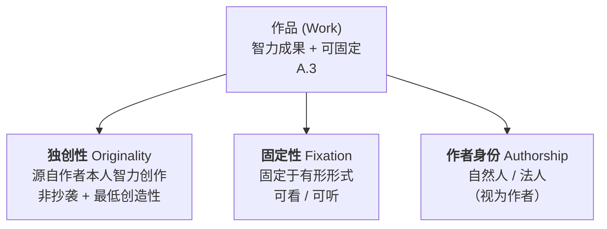
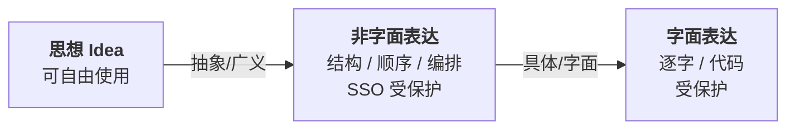
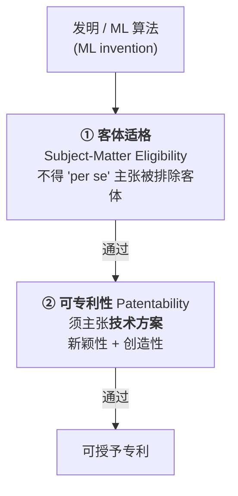

> **七份 PPT 总览**：
> ① 可受著作权保护的条件 (*Copyrightability*)；
> ② 思想/表达二分法 (*Idea/Expression*)；
> ③ 专有权利与限制 (*Exclusive Rights & Limitations*)；
> ④ AI 与著作权作者身份 (*AI Authorship*)；
> ⑤ 著作权侵权与 AI 训练 (*Infringement & AI*)；
> ⑥ 专利发明人与 AI (*Patent Inventorship*)；
> ⑦ 专利法与 AI 可专利性 (*Patentability*)。  
> **页码格式**：`[D1 p25]` = 第 1 份 PPT 第 25 页附近。法条缩写：**PRC CL**=著作权法，**PRC CR**=著作权法实施条例，**PL**=专利法，**PR**=专利法实施细则。

# 著作权保护的要件 (*Requirements for Copyright Protection*)

## 法律渊源与解释 (*Sources & Interpretation*)

- **主要法律**：全国人大《著作权法》PRC CL 1990（2021 修订）+《实施条例》PRC CR 2021 + 软件保护条例等。 *\[D1 p1-3\]*

- 主要法律措辞**宽泛**（要适用不同案情），如**A.3** 用"originality"却无定义。 *\[D1 p4\]*

- **法院解释** (*interpret*)：最高法发布"指导意见/指导性案例/判决"，对各级法院有约束力；地方法院在其**管辖 (*jurisdiction*)**内判案。 *\[D1 p5\]*

- 解释方法：援引法律其他条款、国际条约、他国判例与学理。 *\[D1 p26\]*

## 什么是著作权 (*What is Copyright*)

- **定义**：法律授予各类创造性作品的**一组专有权利 (*exclusive rights*)**，目的是**激励创作** (*incentivize creation*)。 *\[D1 p6\]*

- **A.1** 立法目的：保护作者权利、鼓励创作传播、促进社会主义文化与科学繁荣。 *\[D1 p7\]*

- **A.11** **作者 (*author*)**：创作作品的**自然人**。 *\[D1 p8\]*

- 保护对象 **A.1/A.3**：**文学、艺术、科学**作品；**A.3** 列举为**非穷尽**清单（"such as"）。 *\[D1 p9-10\]*

## 受保护作品类型 **A.3**（9 类，记忆要点）

- 文字、口述；音乐戏剧曲艺舞蹈杂技；美术与建筑；摄影；视听(*cinematographic*)；图形与模型（工程/产品设计图、地图）；**计算机软件**；及法律规定的其他作品。 *\[D1 p11\]*

- **邻接权 (*Related Rights*)**（区别于著作权）：表演者、录音录像制作者、广播组织。 *\[D1 p12\]*

## 三大要件（核心考点）

**① 固定性 (*Fixation*)**：必须**有形 (*tangible*)**——可看、可听、可读。 *\[D1 p24\]*

**② 独创性 (*Originality*)**（无法定定义，由法院解释；联结 **A.11**+**A.3**）： *\[D1 p25-29\]*

- **独立创作 (*independent creation*)**——非抄袭他人；

- **最低创造性 (*minimum creativity*)**——与已有作品有**至少一些差异**；

- **个性化表达 (*personalized expression*)**——体现作者的**选择、判断、安排**与创作自由。

- 比较法：德国"个人智力创作"，法国"作者人格的烙印"，美国 **17 U.S.C. §102(a)** "original works...fixed in any tangible medium"。 *\[D1 p28-29\]*

> **典型例题（判断独创性）**： *\[D1 p30-43\]*
>
> - 梵高真迹 ✔；**精摹复制品 ✗**（复制目标是"忠实",与创作独立性相反，无独立创作选择）。
>
> - **护照证件照 ✗**（无创作自由）；Mankowitz 拍 Jimi Hendrix 肖像 ✔（指导姿势、黑白、选镜头/灯光/角度/取景=自由创作选择）。
>
> - **易错点**：短语/标题/小作品一般**难**获保护，但"人头马一开，好事自然来"广告语经中国法院认定**足够独创** ⇒ 个案判断。

## 作者与"视为作者" **A.11** (*Deemed Author*)

- 原则：著作权属于作者（自然人）。 *\[D1 p44\]*

- **法人/非法人组织"视为作者"**：当作品**由其主持**、**代表其意志**创作、并**由其承担责任**时。 *\[D1 p45\]*

- 各国法律不同，但因国际条约而部分**协调 (*harmonized*)**。 *\[D1 p46\]*

# 思想/表达二分法 (*Idea/Expression Dichotomy*)

> **核心命题**：著作权**只保护表达，不保护思想**（及事实、程序、方法、数学概念）。"思想自由,表达独占"。 *\[D2 p1-9\]*

## 法律依据（多法域一致）

- 中国 CL/CR 未明文，但法院适用；**《软件保护条例》**A.7 明文**：保护不延及开发所用的思想、概念、发现、原理、**算法、处理过程、操作方法。 *\[D2 p4,p24\]*

- 国际：**TRIPS A.9** 与 WIPO 版权条约——保护表达，不及思想/程序/操作方法/数学概念。 *\[D2 p5\]*

- 美国 **§102(b)**：保护不延及任何 idea/procedure/process/system/method/concept/principle/discovery。 *\[D2 p6\]*

## 为何不保护思想（4+1 理由，常考简答）

*\[D2 p7-8\]*

1.  **鼓励创作**：若思想被独占，他人无法在其上构建，扼杀创新（如"用数据训练机器"的思想）；

2.  **思想是公共财产**：属于所有人，是知识/文化的共享基础，允许竞争；

3.  **表达体现独创技巧与判断**：版权奖励表达之努力，而非思想内容本身；

4.  **思想过于抽象**：无法界定"同一思想"，故只保护具体形式（文字/图像/代码）；

5.  **允许多个独立作品**：两人可用不同方式表达同一思想，各自享有版权。

## 表达的两种形式 + 抽象法 (*Abstraction*)

- **字面表达 (*literal*)**：原话、源/目标代码；**非字面表达 (*non-literal / SSO*)**：结构、顺序、组织、选择、安排 (*structure, sequence, organization*)。 *\[D2 p10-11\]*

- 法院**抽象 (*abstraction*)**：① 一般层面的思想可用；② 禁逐字抄袭；③ 亦禁抄袭**非字面表达**。 *\[D2 p13\]*

- **难点**：软件中思想与表达**最难分离**；字面（源/目标代码）受保护，但算法/原理/操作方法不受保护。 *\[D2 p14,p23-25\]*

> **典型案例**： *\[D2 p11-12,p22-23\]*
>
> - **Harry Potter v. Tanya Grotter**：字面表达未抄（俄语）；争点在**非字面表达**是否被抄。
>
> - **红色巴士案 (*Iconic London red bus*)**（英）：Fielder 摄+Photoshop（强化红色、抠天空、转单色、移人、拉透视，耗 80h）⇒ 有独创性。争点：被告是取了**思想**还是**实质性表达**？
>
> - **风格不受保护**：Picasso 立体主义——他人可画立体派三女像，只要不抄其**具体表达**。表达=构图+内容+风格+色彩+叙事的**总和**；单取"风格"不足以获保护。
>
> - **纯事实不受保护**：电话簿白页按字母排列，有劳动投入但无创造性 ⇒ 不可版权。

# 专有权利、限制与执法 (*Exclusive Rights, Limitations & Enforcement*)

## 权利体系 **A.10**

- 专有权利随技术**扩张**：1700s 印刷术→复制权；2025 一本书含多项权利。 *\[D3 p6-7\]*

- 用作品须**许可 (*licence*)**+付**报酬 (*royalty*)**；未经许可使用=**侵权**，承担责任（第五章）。 *\[D3 p8\]*

- **开源 vs 专有**：开源许可无需逐一谈判（条款预设）；专有须逐一谈判许可与付费。 *\[D3 p11\]*

- **公有领域 (*public domain*)**：保护期满后可自由使用，无需许可/付费。 *\[D3 p12\]*

## 两类权利 (*Moral vs Economic Rights*)

- **人格权/精神权利 (*Moral rights*)** **A.10(1)-(4)**（属**作者**）：发表 (*publication*)、署名 (*authorship*)、修改 (*revision*)、保护作品完整 (*integrity*)（禁歪曲篡改）。 *\[D3 p16-19\]*

- **经济权利 (*Economic rights*)** **A.10(5)-(17)**（属**权利人**）：复制、展览、表演、放映、广播、信息网络传播、摄制、改编、翻译、汇编等。 *\[D3 p20-27\]*

- **所有权**：作者为**第一**所有人；亦可为委托人/雇主。 *\[D3 p14-15\]*

- **定义示例**：**A.10(5)** 复制权=印刷/复印/录制/翻拍/数字化等制作一份或多份；**A.10(12)** 信息网络传播权=使公众可在**个人选定的时间地点**获得作品。 *\[D3 p28-29\]*

## 保护期 (*Duration*)（务必记牢）

*\[D3 p30\]*

> **中国**：精神权利=**永久**；经济权利=作者**有生之年 + 死后 50 年**；法人作品=**创作完成后 50 年**。

## 对权利的限制 (*Limitations / Exceptions*) **A.24**

- **正当性**：专有权是创作激励；限制不剥夺激励，为"更大公共利益"，平衡权利人与社会。 *\[D3 p46\]*（如为盲人转盲文，无需许可/付费 *\[D3 p45\]*）

- 中国 **A.24**=**封闭式清单 (*closed list*)**（"下列情形"），多为**非商业**用途；中国约 12 项。 *\[D3 p48,p51\]*

- **两步限制** **A.21 CR**：被许可行为**不得**①不合理损害权利人合法利益 ②影响作品正常使用。 *\[D3 p49\]*

- 比较：英 66 项、欧盟 15 项例外；美/新/韩用**灵活的合理使用 (*fair use*)**，无清单。 *\[D3 p50-52\]*

## 美国合理使用 (*Fair Use*) **17 U.S.C. §107**（高频考点）

**四要素**（个案、由法院判，无硬规则）： *\[D3 p53-55\]*

1.  使用的**目的与性质**（是否**转换性 transformative**/商业 vs 教育）；

2.  被使用作品的**性质**（已否发表）；

3.  使用的**数量与比例**；

4.  对原作**潜在市场/价值**的影响（最关键）。

> **案例对照**： *\[D3 p59-63\]*
>
> - **Authors Guild v. Google (2d Cir. 2015)**：扫描数百万书建可搜索库，仅显示片段 ⇒ **高度转换性**（变为搜索工具），非市场替代 ⇒ **属合理使用**。规则：即使整本复制，只要转换且不损害市场亦可。
>
> - **要点**：商业用途**不必然**推定不合理；非商业/教育用途**不必然**推定合理。
>
> - **周艳明 v. 环球时报 (2012)**（中国限制）：媒体报道中使用封面照——不同传播目的、取用有限、未替代原许可市场 ⇒ 落入 **A.24** 法定例外。

## 侵权抗辩 (*Defences*) 与执法 (*Enforcement*)

- **抗辩**：作品不受保护（无独创性）/ 保护期满 / 行为不在保护范围 / **独立创作非抄袭**（相似系巧合，且无接触 (*no access*)）。 *\[D3 p42\]*

- **侵权后果**：罚款、行政措施、销毁侵权品/停止服务（第五章）。 *\[D3 p40-41\]*

- **民事**：北京/上海/广州**专门 IP 法院**；可临时禁令；法定赔偿**最高 500 万元**。 *\[D3 p64\]*

- **刑事**：严重侵权可判，最高**7 年**有期徒刑；门槛**商业价值 5 万元**；由检察院公诉。 *\[D3 p65\]*

# AI 与著作权作者身份 (*AI & Copyright Authorship*)

> **贯穿主线**：著作权**保护人类创造力**。AI 输出能否受保护，取决于是否有**足够的人类智力投入**。区分 **AI 自主生成 (*AI-generated*)**（无人介入）vs **AI 辅助 (*AI-assisted*)**（有实质人类介入）。 *\[D4 p10-11\]*

## 猴子自拍案 (*Monkey Selfie / Naruto*)

*\[D4 p1-6\]*

- Naruto（猕猴）用 Slater 留置相机拍下自拍。三步法律分析：

  1.  摄影=受保护作品 **A.3(5)**；

  2.  CL 要求**人类（自然人）**作者，且须为**公民** **A.2/A.9**——动物无公民身份 ⇒ Naruto 非作者；

  3.  须**智力创作** **A.2 CR**——动物凭**本能**非智力 ⇒ 不构成作者。

- Slater：设置了相机/角度，但快门是猴子按的、自拍**偶然** ⇒ 是否作者**有争议**（缺创作意图）。

## 各法域立场对比（核心比较表）

| **法域** | **立场**                                                                                                  | **关键案例/依据**                                                                                                                                                                               |
|:---------|:----------------------------------------------------------------------------------------------------------|:------------------------------------------------------------------------------------------------------------------------------------------------------------------------------------------------|
| **美国** | AI 自主生成**不可**版权；须**人类创作选择**，仅**提示词不够**；用 AI 作**工具**精修**可能**受保护         | **Thaler v. Perlmutter**："A Recent Entrance to Paradise"，作者署"Creativity Machine"⇒ 版权局/法院**否定**：版权仅保护"人脑创造力之果"。2025 指南：人类贡献须**超过提示或小修** *\[D4 p12-19\]* |
| **中国** | 更**宽松**、**个案**判断：只要 AI 生成图体现人的**原创性智力投入**即可为作品                              | **李昀锴 v. 刘元春**（北京）：用 Stable Diffusion 输入提示词（含负面提示）+调参生成女子图 ⇒ 认定受著作权保护 *\[D4 p20-22\]*                                                                    |
| **英国** | **自动保护**计算机生成作品（无人类作者）**50 年**（异于"作者+生 70 年"）；作者=**为创作作出必要安排之人** | CDPA 1988；"安排"者可能是公司/程序员或用户；提供商常以**条款**将作者归于用户 *\[D4 p23-27\]*                                                                                                    |

**美国版权局核心说理**（易考）：提示词=传达**不受保护的思想**的指令；用户**无法控制**AI 如何把思想转为固定表达，系统主导表达元素；生成式 AI 还会**内部改写**提示 ⇒ 提示与输出间存在"鸿沟"。 *\[D4 p16-19\]*

# 著作权侵权与 AI 训练 (*Copyright Infringement & AI Training*)

## 两大法律问题

*\[D5 p2-10\]*

1.  **输入端**：将受版权作品用作**训练数据**是否侵权（复制权）？还是合理使用？

2.  **输出端**：AI 输出是否与受版权作品的**表达实质性相似 (*substantially similar*)**？

- 数据获取：网络抓取 (*web scraping*)、公开/许可数据集、学术库、数字图书馆，亦含**盗版内容**（未经许可上传）。 *\[D5 p3\]*

- 训练机制：内容转为**数值模式/嵌入 (*embeddings*)**，原内容通常被丢弃，只留学到的模式。 *\[D5 p5\]*

- **侵权点**：复制进训练集=未经许可/付费的**复制 (*reproduction*)**。 *\[D5 p7\]*

## 标志性诉讼 (*Key Lawsuits*)

- **NYT v. OpenAI**：①将 NYT 文章复制入训练集；②训练后模型可**逐字 (*verbatim*)**复现 NYT 内容。OpenAI 抗辩：训练具**转换性**属**合理使用**；并称原告**"提示词攻击 prompt hacking"**诱导输出，模型**不"记忆"**。 *\[D5 p12-17\]*

- **Getty Images v. Stability AI (2023)**：未经许可用**1200 万**张图训练 Stable Diffusion；模型可复现 Getty**水印**与风格。诉由：版权 + 商标 + 不正当竞争。 *\[D5 p26-29\]*

- **Authors Guild v. Meta/Anthropic/OpenAI**;**Andersen v. Stability AI**（双方论点相似）。 *\[D5 p11,p42\]*

> **双方核心论点对照（必背）**： *\[D5 p38-45\]*  
> **AI 开发者抗辩**：① **合理使用**（转换性、输出不替代原作、无直接市场损害）；② **无直接复制**（只学统计模式，生成新内容）；③ **微量使用 de minimis**；④ **中介非直接侵权**（用户生成侵权物，开发者除非主动诱导否则不担责）；⑤ **技术保障**（水印、数据筛选、训练后过滤）；⑥ **"只复制不受保护的数据"**——抽取的是**事实/思想/风格/技法/统计模式**（均不受版权保护），类比**人类学习**。  
> **版权人反驳**：① 训练**必然**对全文作**未授权完整复制**——复制行为本身即侵权；② 抽取的是**表达性特征**（独特构图/细节/风格选择），非仅思想/事实；③ **记忆与复吐 (*memorization & regurgitation*)**——证据显示模型可复现近乎相同的训练数据（尤其稀有作品）。

## 风格 vs 表达 (*Style vs Expression*)

- 争点：AI 输出是**抄表达**还是仅**模仿风格**（取思想未取表达）？ *\[D5 p30-31\]*

- 风格本身**一般不受保护**（仿大师风格作画、以他人文风写作）。例：Picasso《Guernica》风格仿作；Midjourney 仿 Vermeer《戴珍珠耳环的少女》。 *\[D5 p32-37\]*

## 各法域对 AI 训练数据的立场（比较）

|            |                                                                                                                                                                                                                                                                          |
|:-----------|:-------------------------------------------------------------------------------------------------------------------------------------------------------------------------------------------------------------------------------------------------------------------------|
| **美国**   | 目前**依赖合理使用**，尚无专门例外。 *\[D5 p43\]*                                                                                                                                                                                                                        |
| **欧盟**   | **DSM 指令 A.3/A.4**：研究机构可自由**文本数据挖掘 TDM**；商业用途**除非权利人退出 (*opt-out*)**亦可；须**合法访问**。但 TDM 仅抽**分析性见解**，生成式 AI **内化并复现表达内容**，或**超出 TDM 范围**。**AI Act**：训练数据**透明度**、文档、合规义务。 *\[D5 p45-49\]* |
| **中国**   | **无**专门 AI 训练例外，**无终审判例**（2024.6 北京 4 案，插画师诉 AI 绘图开发商，待判）；《生成式 AI 服务管理暂行办法》**A.7**：服务商训练须用**合法来源**数据，涉 IP **不得侵权**（一般性表述）。 *\[D5 p50-53\]*                                                      |
| **新加坡** | 修法增设**"计算数据分析"**例外，允许用大数据集做 ML 无须权利人许可；**比他国 TDM 更宽**：覆盖商业+非商业，且**不可被合同限制**。 *\[D5 p52\]*                                                                                                                            |

> **奥特曼案 (*Ultraman*)（广州互联网法院，重点判例）**： *\[D5 p54-57\]*  
> SCLA 经 Tsuburaya 授权享奥特曼系列专有权。被告网站经提示（"generate an Ultraman Dyna"）生成的图与奥特曼**部分或完全相似**。**判决**：奥特曼为原创美术作品受保护；AI 生成图**同时侵犯复制权（复制原画）与改编权（未经许可修改）**。  
> **解决方案建议**（政策）：强制许可、集体管理、退出机制 (*opt-out*)、仅研究例外、补偿制。 *\[D5 p44\]*

# 专利发明人与 AI 作为发明人 (*Patent Inventorship & AI*)

## 发明人与所有权 **A.6/A.7 PL**

- **自行发明**：发明人=所有人；**职务发明 (*employment invention*)**：所有人=**雇主**，但发明人有**署名权** **A.17 PL**。 *\[D6 p2\]*

- **职务发明判定** **Rule 12 PR**："履行本职工作"/分配任务/**离职后一年内**且**用了雇主的物质技术条件**。 *\[D6 p2-3\]*

- **发明人定义 **Rule 13 PR****：对发明**实质性特点作出创造性贡献**的人；仅作**组织工作**、**提供物质技术便利**或**辅助工作**者**不算**发明人。 *\[D6 p3\]*

- 共同发明人或经合同分割可**共有**专利。专利权人可：禁他人制造/使用/销售、许可、起诉侵权、转让。 *\[D6 p3-4\]*

## AI 能否作为发明人 (*AI as Inventor*)

> **核心结论**：现行法**仅承认人类**为有效发明人。**DABUS** AI（发明食品容器+警示灯）引发全球首批 AI 发明人案，申请**多被驳回**。 *\[D6 p7-9\]*

- AI 无法律人格：不能签法律文件、转让权利、被诉侵权、获报酬，**无道德/法律问责**。 *\[D6 p14\]*

- 现实：多数"AI 发明"是**人机协作**；难划"AI 辅助 vs AI 发明"之线；AI 多为**优化/组合已知要素**，是否真"发明"存疑。 *\[D6 p13\]*

- **各国指南趋同**：USPTO/EPO**驳回**AI 作发明人；**美国指南**：AI 不可列为发明人，但自然人**使用**AI **不妨碍**其在**重大贡献**时成为（共同）发明人；EU/中国**类似**。 *\[D6 p16,p23-25\]*

- **Moderna 例**：用 AI/ML 做 mRNA 序列优化/蛋白结构预测/候选筛选，但专利**只列人类发明人**——AI 视为**辅助工具**（如先进实验设备），关键决策由人作出。 *\[D6 p18-22\]*

- **三大挑战**：法律承认（限制 AI 持专利）、所有权归属（纠纷）、伦理（机器发明人之问责）。 *\[D6 p26\]*

# 专利法基础与 AI 可专利性 (*Patent Law & AI Patentability*)

## 专利基础 (*Fundamentals*)

- **保护对象**：**一切技术领域**的发明。**A.2 PL/Rule 2**：**发明 (*invention*)**=关于**产品、方法或其改进**的**新技术方案 (*new technical solution*)**。 *\[D7 p1-5\]*

- **对价 (*quid pro quo*)**：**公开发明 (*disclosure*)** 换取**20 年独占**（排他权，控制商业使用）。 *\[D7 p7-8\]*

- **获权特征**：由申请国专利局**审查 (*examination*)**；仅约 **30%** 申请成功；可被**异议**；**属地性**（每国分别申请，有国际申请体系）；授权后须缴**年费**维持。 *\[D7 p9-13\]*

## 可专利性两道门槛（核心框架）

- AI 属计算机科学分支 ⇒ 涉 AI 发明为**计算机实施的发明 (*computer-implemented inventions, CII*)**。AI 模型**应用无关 (*application-agnostic*)**，可用于任一技术领域。 *\[D7 p17-19\]*

- **被排除客体 (*excluded per se*)**（CPO 视为**智力活动**）：**科学发现、智力活动的规则和方法、数学方法、商业方法、计算机程序**。AI 基于计算模型/数学算法，**本质抽象** ⇒ per se 被排除。 *\[D7 p23-25\]*

> **关键规则（CNIPA）**：被排除客体**per se 排除，但若主张得当则不排除**。若权利要求含**一项或多项技术特征 + 算法特征** ⇒ 不再是"智力活动的规则和方法"，可成适格客体。 *\[D7 p26\]*

## CNIPA "整体看权利要求"——技术三要素测试 (*Three-Elements Test*)

*\[D7 p27-32\]*

| **要素**                           | **问句** | **审查内容**                                        |
|:-----------------------------------|:---------|:----------------------------------------------------|
| **技术手段 (*Technical Means*)**   | How?     | 用什么技术工具/方法？涉及何种软硬件组件？如何协同？ |
| **技术问题 (*Technical Problem*)** | Why?     | 解决何具体技术问题？此前何处不灵？需改进什么？      |
| **技术效果 (*Technical Effect*)**  | Results? | 取得何**可衡量**改进？比之前好在哪？有何具体结果？  |

**AI/大数据算法成为适格客体的两条路径**： *\[D7 p29-31\]*

1.  算法与**计算机系统内部结构**有特定技术关系，能**改善计算机内部性能**（符合自然规律）——即算法须真正**改变硬件/底层软件运行方式**，而非仅在其上运行；

2.  在**具体应用领域**处理**大数据**：利用符合自然规律的数据内在关系，解决**提升大数据分析可靠性/准确性**的技术问题并获相应效果（找真实规律、非随意关联）。

**创造性审查**：算法特征若支持技术功能、改善内部性能，须纳入考量；技术特征+算法+商业规则若**相互支持改善用户体验**（操作舒适、缩短等待等**客观**技术效果，非主观偏好）亦可考量。 *\[D7 p32\]*

> **典型例题（可专利性判断）**： *\[D7 p33-49\]*  
> **✔ 神经网络心律失常检测仪 (*Cardiac Arrhythmia Detection*)**：硬件医疗设备 + 神经网络（输入层 ECG 处理→隐层模式识别→输出层分类）。技术问题=实时准确检测、减少假阳/假阴；技术效果=精度↑、响应↑、医疗差错↓；将**原始 ECG 信号→临床诊断**。**超越纯软件、需特定硬件** ⇒ 可专利。  
> **判别标准**：ML 发明须 ① 产生超越数学的**技术效果**；② 解决**具体技术问题**；③ 与**物理组件/过程**交互。  
> **✔ 可专利**：卫星图像探矿 ML（用真实地质规律、提升矿物检测准确性）；控制工业过程、AI 医疗诊断、计算机视觉解特定技术问题、改善计算机自身功能、优化网络性能。  
> **✗ 不可专利**：分析社媒预测时尚趋势 ML（用人类偏好**非自然规律**、不解决技术问题）；基础神经网络架构、标准优化函数、通用训练法、抽象数学关系、纯数据处理（视为数学算法）。

—— 复习速查表完 · 共 7 份 PPT / 315 页源材料 ——
