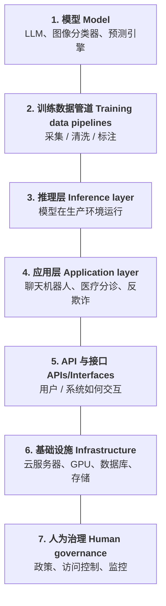
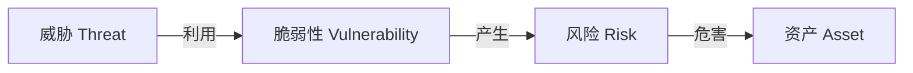

> **页码引用图例：** *\[框架 p\]* = Data-Protection-Frameworks； *\[隐私 p\]* = AI-and-Privacy； *\[安全 p\]* = AI-and-Security； *\[聊 p\]* = AI Mental Health Chatbot。 p 为该课件的幻灯片页码。

> **本周主线（一句话）：**所有 AI 系统都是**分层的**，而数据保护法（GDPR/PIPL）与安全义务**贯穿每一层**；考试核心是用识别问题—规则—适用—结论（*IRAC*） 把法律**适用到事实**。 *\[隐私 2-3\]* *\[安全 14\]* *\[框架 6-7\]*

# 贯穿全周的两个基础图

## 图1：AI 系统的七层（贯穿四份课件）

任何风险/法律义务都要问"发生在哪一层"。 *\[框架 6\]* *\[隐私 2\]* *\[安全 14\]*

## 图2：安全的核心关系（资产—威胁—脆弱性—风险）

*\[安全 8-11\]*

> **风险公式（必背）：** 风险 Risk = 可能性 Likelihood × 影响 Impact； 可能性 = 威胁利用脆弱性的概率；影响 = 损失/不利后果。风险**可评估、可度量、可管理**。 *\[安全 9-11\]*

# 模块一：数据保护法框架（Data-Protection-Frameworks）

## 1.1 三大法域对比（高频考点）

*\[框架 9-12,40,42\]*

|          | **GDPR（EU）**           | **PIPL（中国）**               | **CCPA/CPRA（加州）**                  |
|:---------|:-------------------------|:-------------------------------|:---------------------------------------|
| **定位** | 全球隐私基准             | "中国版 GDPR"，以 GDPR 为蓝本  | "加州版 GDPR"，偏消费者保护            |
| **生效** | 2018                     | 2021-11-01                     | ——                                     |
| **适用** | 所有个人数据，公私部门   | 所有数据，重私营；另有 CSL/DSL | 州法 + 行业法（健康/金融/教育）        |
| **核心** | 处理前需**合法性基础**   | 强**同意**+本地化+跨境限制     | 给**选择退出**权，不要求事前合法性基础 |
| **处罚** | €2000万 或全球营收**4%** | ¥5000万 或年营收**5%**         | ——                                     |
| **域外** | 有域外效力               | 有域外效力                     | ——                                     |

> [!warning] 易错点 / 陷阱
> **易错点：**CCPA/CPRA **不**像 GDPR 那样要求收集前有"合法性基础"，它主要给"opt-out / 访问 / 删除 / 更正"权。 *\[框架 12\]*

## 1.2 核心定义

*\[框架 17-32\]*

- 个人数据（*Personal data*）：任何与可**直接或间接识别**某自然人（数据主体（*data subject*））相关的信息；应作**最广义**解释（GDPR），PIPL 称"各种信息"。例：姓名、住址、IP、设备ID、GPS、生物特征、健康/基因、CCTV 等。 *\[框架 17-19\]*

- 敏感/特殊类别数据（*Sensitive / Special category data*）：处理须额外严格。

  - **GDPR**：种族/民族、政治观点、宗教/哲学信仰、工会、基因、（用于唯一识别的）生物特征、健康、性生活/性取向。 *\[框架 24\]*

  - **PIPL**：生物识别、宗教信仰、特定身份、医疗健康、金融账户、行踪轨迹，及**不满14岁未成年人**信息。 *\[框架 24\]*

- 匿名化数据（*Anonymized data*）：处理后**无法**直接或间接再识别，且**再识别在合理手段下不可能**——**不属于**个人数据，不受法律约束。 *\[框架 25-26\]*

- 假名化数据（*Pseudonymized data*）：直接标识符被替换为代码/别名，但组织**仍持有可还原的"钥匙"**——**仍属于**个人数据。要求附加信息分开保存+技术组织措施。 *\[框架 30-32\]*

> **判据（识别可能性 identifiability）：**是否"个人数据"取决于**合理识别手段**——可用技术、时间与成本、技术可行性。即使表面匿名，若能结合其他信息识别个人，仍是个人数据。 *\[框架 29-30\]*

> [!warning] 易错点 / 陷阱
> **典型例题——Netflix Prize 案：**Netflix 公开约48万用户"匿名"评分数据（随机ID+影片+评分+日期）。Narayanan & Shmatikov（2007）用 IMDb 公开评分**重新识别**了用户——**少量评分+日期即可唯一定位个人**。结论：声称"匿名"≠真匿名，关键看**再识别风险**。 *\[框架 27-29\]*  
> **速练（框架 33）：**给定"刘一阳，2004-03-14生，北京朝阳…，2025-10-10确诊哮喘" = 可识别的**敏感个人数据**；"北京某25–30岁患者…确诊哮喘" = 趋向匿名；"患者ID 58472，生于14-03-2004，邮编区100020…" = **假名化**（可结合再识别）。

## 1.3 角色与执法

*\[框架 37-42\]*

- **GDPR**：数据控制者（*Data Controller*）决定处理的目的与方式——**主要责任**；数据处理者（*Data Processor*）代控制者处理（如云服务商）——**次要责任**。

- **PIPL**：个人信息处理者（*Personal information processor*）（独立决定目的方式，主责）vs 受托处理者（*Entrusted processor*）（按合同处理并受监督）。

- **执法机关**：GDPR——各成员国数据保护机构（*DPA*）；PIPL——网信办（*Cyberspace Administration of China, CAC*）等。 *\[框架 40\]*

## 1.4 七大数据保护原则（必背口诀）

*\[框架 44-45\]*

1.  合法、公平、透明（*Lawfulness, Fairness & Transparency*）

2.  目的限制（*Purpose Limitation*）——仅为特定、明确、正当目的收集

3.  数据最小化（*Data Minimization*）——只收集必要的

4.  准确性（*Accuracy*）——保持准确、及时更新

5.  存储限制（*Storage Limitation*）——仅保存必要时长

6.  完整性与保密性（*Integrity & Confidentiality*）——适当安全保护

7.  问责（*Accountability*）——须**证明**合规

## 1.5 合法处理的基础（Lawful Basis）

*\[框架 48-57\]*

- **GDPR 同意 Consent**：须"**自由给予、具体、知情、明确**"；请求须与其他事项清晰区分、用平实语言；可**随时撤回**且不得事后改换法律基础；**13岁以下**须父母许可；须保留同意的书面证据。 *\[框架 52\]*

- **PIPL 同意**：须**知情、自愿、明确、书面记录、特定目的**。下列须**单独同意（separate consent）**：跨境传输、向第三方共享、公开个人信息、处理敏感个人信息、用于自动化决策。撤回须与给予一样容易。 *\[框架 52(PIPL)\]*

- 正当利益（*Legitimate Interest*）（GDPR 灵活基础，需过三步测试）：  
  **（1） 目的**（有正当利益）→ **（2） 必要性**（处理为该利益所必需）→ **（3） 平衡**（你的利益不压倒个人权利自由）。**不适用于敏感数据**。例：反欺诈、对现有客户直销、网络安全、集团内传输、（适度）员工监控。 *\[框架 54-56\]*

- **PIPL 非同意基础**：合同必要、法定义务、突发公共卫生事件等（A.13）。 *\[框架 57\]*

> **GDPR vs PIPL 关键差异：**PIPL **更依赖同意**作为主要基础，并对更多场景要求**单独同意**。 *\[框架 53(PIPL)\]*

## 1.6 控制者义务 + 跨境传输

*\[框架 59-64\]*

- **义务四块**：（1） 问责（处理记录、隐私设计、必要时 DPIA/DPO、培训、审计）；（2） 安全（技术措施、违约响应、**72小时违约通报**、风险评估）；（3） 第三方与传输（尽职调查、处理协议、SCCs）；（4） 透明（隐私声明、权利请求处理、同意管理）。 *\[框架 59-60\]*

- **跨境传输**：

  - **GDPR**：仅当接收国有**同等保护**才可出境；机制 = 充分性决定（*adequacy decisions*）、标准合同条款（*SCCs*）、有约束力企业规则（*BCRs*）；传输前做传输影响评估（*TIA*）。 *\[框架 62\]*

  - **PIPL**：常需**政府安全评估**、官方认证或标准合同；重要数据/大量数据面临额外限制与**本地化**；个人须被告知并**单独同意**。 *\[框架 64\]*

## 1.7 权利可限制（非绝对）

数据保护权强但**非绝对**；当安全、司法、公共健康等更广社会利益压倒隐私时可限制，但限制须**合法、必要、相称**。例外领域：执法/犯罪预防、法定义务（税务/审计/法院）、科研、公共卫生/突发事件、国家安全/公共安全。 *\[框架 65-66\]*

# 模块二：AI 与隐私（AI-and-Privacy）

## 2.1 AI 开发/部署中的隐私风险

*\[隐私 4\]* 收集敏感数据 · 未经同意收集 · **超目的复用**（无同意改用途）· 不受约束的监控与偏见 · 数据外泄/泄露（*Data exfiltration/leakage*） · 跨境传输。

> **本模块核心论点：**EU 与中国数据保护法的**法律要求差异**，造就了**根本不同的运营环境**（fundamentally different operating environments）。 *\[隐私 5\]*

## 2.2 GDPR 在 AI 训练中的难点

*\[隐私 7-9\]*

- **主焦点**：个人权利（对数据的选择/控制，对敏感数据严格）+ 确保整个 AI 生命周期**合法、公平、透明**处理。基础模型采集海量数据，**技术上难以分离个人与非个人数据**。 *\[隐私 7\]*

- **训练数据合法基础（Article 6）两条路**： *\[隐私 8\]*

  - 同意（*Consent*）：对大规模抓取**不现实**。

  - 正当利益（*Legitimate Interest*）：抓取常**不可见、高风险**，用户隐私权往往**压倒**公司利益，**极难通过三步测试**。

- **跨境传输难点**：限制全球云使用（AWS/Azure/腾讯等）→ 推动**本地化**与"区域内训练（*train-in-region*）"架构。 *\[隐私 9\]*

## 2.3 GDPR 执法案例（高频，必记事实+争点）

- **OpenAI/ChatGPT（意大利等）**：用户对话与支付信息**数据泄露**（暴露给他人）；"为训练算法而大规模收集存储个人数据"**无合法基础**。 *\[隐私 10-11\]*

- **DeepSeek**：跨境数据传输实践**不符合 GDPR**。 *\[隐私 14-15\]*

- Clearview AI 案（*Clearview AI*）： *\[隐私 16-19\]*

  - 事实：美国公司从社媒抓取约**300亿张**公开照片+元数据，建**人脸识别**库，卖给美国执法部门。

  - 争点：为何美国公司在 EU 因 GDPR 被诉？——GDPR 对**非欧盟**公司也适用，只要其活动涉及"**监控欧盟境内个人行为**"。Clearview 辩称仅抓取公开图片、非"监控行为"，但 DPA 不认同。

  - **讨论题（必背三问）**：公开发布的照片是"个人数据"吗？公开发布=同意抓取吗？人脸识别**嵌入向量**（embeddings）是"个人数据"吗？

- X 训练 Grok 案（2024）（*X training Grok*）： *\[隐私 20-31\]*

  - 事实：用欧盟用户在 X 的**公开帖子**（含姓名、观点、信仰、位置等敏感数据）训练 LLM，用户未被清楚告知。

  - 手法：用**"默认开启"同意设置**（default on, 可 opt-out）；法律基础主张**正当利益**（Art 6(1)(f)）。

  - noyb（*noyb*） 投诉：未取得训练同意；主张 X **缺乏**正当利益。

  - 结果：爱尔兰 DPC（*Data Protection Commission*）申请高院中止处理（2024-08-08听审）；X **同意暂停**处理欧盟/EEA 用户公开帖，未经法院命令即达成。

  - DPA 分歧→**法律不确定性**：ICO/CNIL/EDPB 支持可依赖正当利益；荷兰反对。 *\[隐私 31\]*

> **关键结论（隐私 30）：**正当利益（*Legitimate Interests*）往往是 AI 模型训练**唯一可行**的合法基础；"简单解法"其实是**直接问用户要明确同意**——只要少量用户同意"捐赠"数据即足够训练（隐私 26）。

## 2.4 PIPL 在 AI 中的风险与跨境

*\[隐私 34-41\]*

- **训练数据三风险**：（1） 非法数据来源（如无明确条款的网络抓取，《生成式AI服务管理暂行办法 2023》）；（2） **敏感个人信息(SPI)未取得单独同意**；（3） 违反**数据本地化**。 *\[隐私 34\]*

- **跨境触发门槛**（PIPL/CSL/DSL）：任何"重要数据"传输；关键信息基础设施运营者（*CIIO*）传任何个人数据；非 CIIO 的 PI——**\>100万人**非敏感数据 或 **\>1万人**敏感数据。 *\[隐私 36\]*

- **按 AI 层看跨境控制**：训练管道=最高风险（需 SCCs/充分性+TIA）；模型权重导出=隐性传输风险（加密/令牌化）；推理层=数据本地化/驻留；应用层=实时传输须告知并具合同必要性；API=端到端加密、只传必要 PII；基础设施=BCRs/SCCs；人为治理=基于角色的访问控制（*RBAC*）+审计。 *\[隐私 37-39\]*

- **中国取向**：强调**国家安全与社会稳定**高于创新灵活性；国际 AI 公司面临进入中国/获取中国数据的重大壁垒。 *\[隐私 40-41\]*

## 2.5 GDPR/PIPL 对 AI 的其他影响

*\[隐私 42-43\]*

- **数据最小化冲突**：AI 需要数据**数量**，与最小化原则冲突。

- **数据获取**：无法核实海量采购数据集中**每条记录**都有合法基础。

- 再识别风险（*Re-identification risk*）：假名/匿名化不足→模型本身或其输出可能**无意泄露/记忆**训练集中个人细节。

## 2.6 敏感数据模型 + 自动化决策（重点法条）

*\[隐私 44-48\]*

- **处理敏感数据**：GDPR 需**明确法律基础**，PIPL 需**单独、特定同意**，且须严格证明**必要性**。典型 AI：健康 AI（诊断/药物发现/风险预测）、生物识别 AI（人脸/情绪/步态）、金融 AI（贷款/保险核保）。 *\[隐私 44-45\]*

- 自动化决策与画像（*Automated Decision-Making & Profiling*）：典型——招聘/HR AI（简历/视频打分）、信用评分 AI、预测性警务/司法 AI。 *\[隐私 46-47\]*

> **GDPR 第22条（必背）：**个人有权**不**受**完全基于自动化处理**、且产生**法律效果或重大影响**之决定的约束（如拒贷、拒录）。PIPL 有类似规则：要求**透明**并赋予**拒绝**自动化决策的权利。 *\[隐私 48\]*

## 2.7 合规五大重点领域

（1） 合法基础与目的 （2） 风险管理 （3） 设计与最小化 （4） 透明与权利 （5） 跨境传输。 *\[隐私 50\]*

# 模块三：AI 与安全（AI-and-Security）

## 3.1 安全基础概念

*\[安全 8-13\]*

- **安全**=保护资产（*asset*）免受伤害；伤害来自各种威胁，风险可评估/度量/管理。

- **术语链**：威胁(Threat) → 利用脆弱性(Vulnerability) → 产生风险(Risk) → 危害资产(Asset)。（见前文图2 + 风险公式）

- 五类控制（*Controls*）（管理风险，可多重）：**识别(Identify) · 检测(Detect) · 预防(Prevent) · 响应(Respond) · 恢复(Recover)**。 *\[安全 13\]*

## 3.2 两类 AI 安全风险 + 适用法律

*\[安全 15-21\]*

- **传统威胁**：针对信息（含 PII）与信息系统；**AI 特有威胁**：针对 AI 系统本身。

- 信息安全三性 / CIA（*CIA triad*）：机密性（*Confidentiality*） · 完整性（*Integrity*） · 可用性（*Availability*）——防止未授权访问/使用/披露/中断/篡改/破坏。 *\[安全 18\]*

- GDPR 第32条（*Article 32*）：控制者/处理者须按风险实施**适当**安全措施——**技术措施**（加密、访问控制）+**组织措施**（政策、员工培训）；**基于风险的弹性标准**，考量成本、处理的性质/范围/背景/目的、涉及方数量、所用系统。 *\[安全 18-21\]*

- PIPL 第9条（*PIPL A.9*）：处理者须采取**必要措施**：内部规则+指定数据保护人员、数据分类+技术保障、严格访问控制+监控、违约响应+强制通报、高风险处理的 PIA+供应商监督。 *\[安全 A.9\]*

## 3.3 AI 模型安全：四种攻击（必背表）

*\[安全 模型安全\]*

| **攻击**                                                  | 描述                                                                                        | 时点/支柱  |
|:----------------------------------------------------------|:--------------------------------------------------------------------------------------------|:-----------|
| **模型窃取（*Model Stealing / Extraction*）**             | 反复查询已部署模型，复制其专有逻辑，造出高精度副本（IP 盗窃）                               | 部署后     |
| **后门攻击（*Backdoor Attack*）**                         | 训练时植入隐藏恶意**触发器**；平时正常，遇特定秘密输入即输出预定错误结果                    | 训练时     |
| **数据投毒（*Data Poisoning*）**                          | 向训练集注入恶意/错标/损坏数据，使模型学到错误关联或系统性后门                              | **部署前** |
| **对抗样本/逃逸攻击（*Adversarial Examples / Evasion*）** | 对输入做**细微、常不可察**的改动（如给图像/文本加噪），使部署模型输出错误（如误判停车标志） | 推理时     |

## 3.4 数据与输入攻击（针对 LLM/生成式 AI）

*\[安全 数据输入攻击\]*

| **攻击**                                                 | 描述                                                                                           | CIA    |
|:---------------------------------------------------------|:-----------------------------------------------------------------------------------------------|:-------|
| **提示注入（*Prompt Injection*）**                       | 在看似合法的提示中藏恶意指令，绕过安全策略（"越狱"jailbreaking），泄露内部信息或执行未授权操作 | 完整性 |
| **敏感数据披露/隐私泄露（*Sensitive Data Disclosure*）** | 生成模型因**记忆**训练集片段，被特定方式查询时输出私密/专有信息                                | 机密性 |
| **不安全输出处理（*Insecure Output Handling*）**         | 模型输出未净化，若喂入下游系统可执行恶意代码（如 LLM 生成恶意脚本被浏览器执行）                | 完整性 |
| **数据推断攻击（*Data Inference Attacks*）**             | 分析模型输出，推断训练集或个人的受保护信息（无需完整模型反演）                                 | 机密性 |

## 3.5 系统与基础设施风险

*\[安全 供应链\]*

- 供应链脆弱性（*Supply Chain Vulnerabilities*）：依赖第三方组件（预训练模型、开源数据集、库、API），任一组件含漏洞/恶意代码即危及整个系统**完整性**。

- **AI 系统与基础设施安全**：环境中的传统漏洞（未打补丁的 API、弱访问控制）波及云、MLOps 管道、数据存储——影响**机密性与可用性**。

## 3.6 缓解策略与隐私增强技术（PETs）

*\[安全 缓解\]*

> **分层三部防御：**数据溯源（*Data Provenance*） + 模型鲁棒性（*Model Robustness*） + 推理监控（*Inference Monitoring*）。

- **应对数据投毒**：数据溯源与验证（异常检测/聚类过滤离群点）+ 鲁棒训练算法（如联邦学习中的鲁棒聚合）+ 访问控制（防内部注入）。

- 联邦学习（*Federated Learning*）：在**分布式数据源**上协作训练而**不集中原始数据**——**输入隐私**（Input Privacy，保护训练数据）。 *\[安全 FL\]*

- 差分隐私（*Differential Privacy*）：训练时加**校准噪声**防止提取单条记录——**输出隐私**（Output Privacy，防从模型输出中提取）。 *\[安全 DP\]*

- 隐私/安全设计 第25条（*Data protection by design & by default, Art 25*）：默认最小数据使用+风险控制**从一开始内建**；风险越高→更强的安全/监控/文档。 *\[安全 25\]*

## 3.7 模型安全 vs 系统安全

*\[安全 模型vs系统\]*

|          | **模型安全 Model Security** | **系统安全 System Security** |
|:---------|:----------------------------|:-----------------------------|
| 保护对象 | AI 算法本身                 | 整个 AI 应用                 |
| 焦点     | 权重、架构、训练过程        | 基础设施、用户、接口         |
| 威胁     | 模型窃取、投毒              | 勒索软件、API 滥用、数据泄露 |

## 3.8 NCSC《安全 AI 系统开发指南》四阶段

*\[安全 NCSC\]*

- **安全设计**：员工威胁意识、系统化威胁建模、安全与功能并重、考虑供应链、对 AI 触发的动作加限制。

- **安全开发**：保护供应链、用可信来源组件、识别保护资产、记录数据/模型/提示、管理技术债。

- **安全部署**：保护基础设施、持续防护模型免受直接/间接访问、事件管理流程、经安全评估后**负责任地发布**。

- **安全运营与维护**：监控行为与输入、安全的更新（默认自动更新）、收集分享经验教训、参与信息共享社区。

**UK 政府要求**：提供方应在模型/管道/系统内尽可能实施安全控制，**默认最安全选项**；无法缓解的风险须**告知下游用户**并指导其安全使用。 *\[安全 UKgov\]*

> **模块小结：**AI 系统多组件→既有**传统 CIA 风险**也有**AI 特有新风险**；风险源于可被利用的"脆弱性"；理解脆弱性如何被利用，并用**控制/措施**管理、降低、缓解风险。处罚可经专门法或一般法律原则（如**侵权法 tort law**）。 *\[安全 小结\]*

# 模块四：案例——AI 心理健康聊天机器人（Mental Health Chatbot）

## 4.1 聊天机器人如何训练（三层）

*\[聊 9-13\]*

- **(a) 基础模型预训练**：LLM 在公共网络文本、书籍、论坛、授权数据集上训练——学语言模式与"类共情"措辞，**非治疗**；**离线、历史性**，多数合规系统**不**实时学习当下用户。 *\[聊 10\]*

- **(b) 心理健康微调**：专业人员撰写的治疗对话、临床合成对话、人类反馈强化学习（*RLHF*）；目标=支持性非评判语言、**避免诊断/医疗主张**、鼓励线下求助；好系统在此阶段**主动避免真实病患数据**以降低法律风险。 *\[聊 11-12\]*

- **(c) 部署期提示与护栏**：系统提示（"支持性但非临床助手"）、安全分类器（*safety classifiers*）（自残检测）、升级逻辑（*escalation logic*）（"请联系可信成人/求助热线"）。**此层对实际行为的影响常大于模型本身**。 *\[聊 13\]*

## 4.2 真正的隐私风险在"部署"而非"训练"

*\[聊 14-18\]*

> **核心论点：**最大隐私风险**不来自训练，来自部署**。聊天机器人在**情感信任、半匿名、不完善安全治理**下处理**极敏感数据**。 *\[聊 14,26\]*

- **(a) 个人数据处理**：青少年心理健康对话含姓名/年龄/学校、心理状况、家庭情况、自残意念——属 GDPR **特殊类别**、PIPL/CPRA **敏感个人信息**、**儿童数据**（更高保护）。"即使模型不记得，系统记得。" *\[聊 15-16\]*

- **(b) 数据留存与二次使用**：监管关注——是否存储？多久？人工审阅？用于"模型改进"？若对话被复用于训练/分析=**新的处理**，需明确保障与**父母同意**。 *\[聊 17\]*

- **(c) 虚假匿名感**：青少年以为"只是 AI 朋友、没人看"，但日志可能存在、滥用监控团队可能审阅被标记对话、数据可能存于境外——**期望落差本身即隐私风险**。 *\[聊 18\]*

## 4.3 安全风险（不止黑客）——CIA 视角

*\[聊 19-21\]*

- **机密性失效**：聊天日志泄露、公司内部访问控制差、云存储配置错误——对青少年造成名誉/心理/长期伤害。

- **完整性风险（操纵与提示攻击）**：提示注入（"忽略安全规则"）、长对话上下文操纵、恶意测试削弱护栏——**不安全建议危害所有人**，在自残情境尤危险。

- **可用性与依赖风险**：服务中断/撤回致用户痛苦；过度依赖挤占人类支持——安全也关乎**韧性与连续性**。

## 4.4 核心模型安全关切（本用例特有）

*\[聊 22-25\]* **不是主要担忧**：模型盗窃、权重提取、IP 泄露（本用例次要）。**真正核心**：

- 记忆风险（*Memorisation risk*）：若微调不当或用真实对话训练→可能**复述**先前对话片段→隐私泄露+信任崩塌+法律风险。

- 对齐衰减（*Alignment decay*）：模型随时间**漂移**出安全约束、对危机信号反应不一致——是**模型治理**风险，非单纯代码 bug。

- 模型不透明（*Model opacity*）：无人（含开发者）能完全解释"为何此刻对此青少年给出此回应"——带来问责、审计、损害发生时的**责任**难题。

# 考试信息与答题技巧（来自 Tutorial/Revision）

*\[聊 5-6\]*

> **考试格式：闭卷、线下**；共**4题**（论述题+问题解决题混合），**任选3题**作答；**3小时**窗口；占总成绩**50%**。用笔记、复习指南、past papers、案例与情景复习。 *\[聊 5\]*

> [!warning] 易错点 / 陷阱
> **常见错误（必看）：** *\[聊 6\]*
>
> - 避免肤浅/泛泛作答——须**展示理解**。
>
> - **把法律适用到事实**——不要只罗列规则。
>
> - 分析前先**清楚识别法律争点**。
>
> - 强答案**承认对立论点**并论证立场。
>
> - 管理时间、结构清晰。
>
> - **答题框架：**争点 → 规则 → 适用 → 结论（*Issue → Rule → Application → Conclusion (IRAC)*）。

 本速查表基于第四周四份课件整理 · 页码引用见各条 \[ \] · 复习时建议配合 short notes 与案例研读
